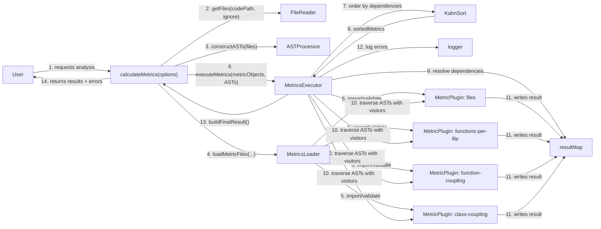
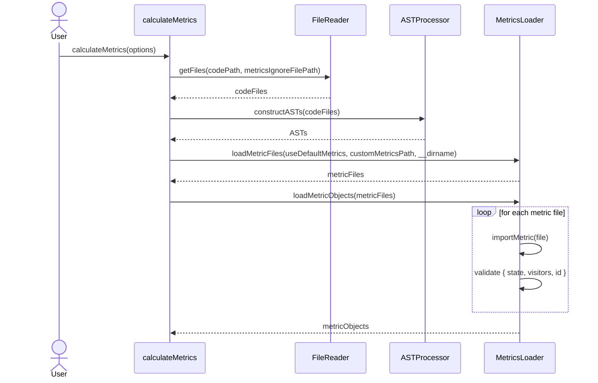
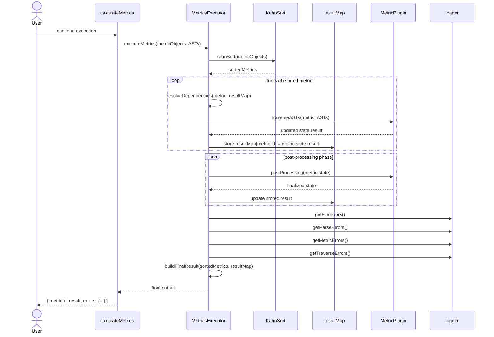
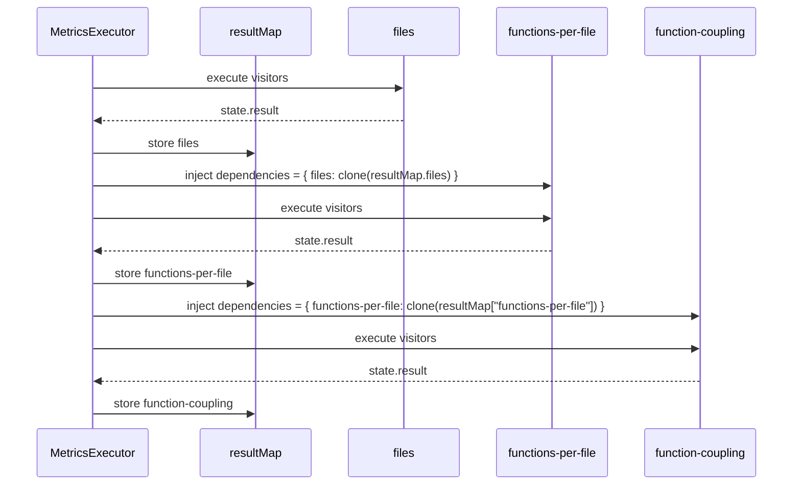

# JTMetrics Architecture

This document describes how JTMetrics loads, executes, and returns metric results.

The project is implemented mostly with modules and plain objects rather than a deep class hierarchy. Because of that, the diagrams below are conceptual: they model the main runtime collaborators and the plugin contract used by the engine.

## Overview

JTMetrics follows a staged analysis pipeline:

1. Discover source files.
2. Parse source files into ASTs.
3. Discover and import metric plugins.
4. Order metrics by dependency.
5. Execute each metric over the AST set.
6. Run metric post-processing.
7. Build the final output with metric results and accumulated errors.

At the center of the design is a lightweight plugin model:

- A metric is a module that exports `state`, `visitors`, and optionally `postProcessing`.
- Metrics may depend on results from other metrics through `state.dependencies`.
- The engine resolves those dependencies before executing each metric.

## Main Runtime Elements

- `calculateMetrics`: Public entry point and orchestration facade.
- `FileReader`: Recursively discovers supported source files and applies ignore rules.
- `ASTProcessor`: Parses source files with Babel and annotates ASTs with file metadata.
- `MetricsLoader`: Discovers metric files, dynamically imports them, and validates the plugin contract.
- `MetricsExecutor`: Sorts metrics, injects dependencies, traverses ASTs, runs post-processing, and builds the final result.
- `KahnSort`: Produces a topological execution order based on metric dependencies.
- `resultMap`: Internal registry of intermediate metric results keyed by metric id.
- `logger`: Shared singleton used to accumulate file, parse, metric, and traversal errors.

## Metric Plugin Contract

Each metric behaves like a plugin with this structural contract:

```js
export const state = {
  id: 'metric-id',
  name: 'Metric Name',
  description: 'What the metric computes',
  result: {},
  dependencies: ['other-metric-id'],
  status: false
}

export const visitors = {
  Program(path, state) {
    // collect data
  }
}

export function postProcessing(state) {
  state.status = true
}
```

This is not enforced through classes or interfaces at runtime. Instead, it is validated when the metric module is imported.

## Object Collaboration Diagram



## Sequence Diagram: Loading and Preparation



## Sequence Diagram: Metric Execution and Result Delivery



## Sequence Diagram: Dependency Resolution Between Metrics



## Design Notes

- The public API behaves like a facade over the whole analysis pipeline.
- Metrics form a plugin system based on a module contract rather than inheritance.
- AST analysis is implemented with the Visitor pattern through Babel visitors.
- Metric dependencies form a directed acyclic graph that is executed in topological order.
- Results are exchanged through an internal registry (`resultMap`) instead of direct metric-to-metric calls.
- Some metrics are internal helpers. For example, `instance-mapper` can be marked with `ignore: true` so it supports other metrics without appearing in the exported result.

## Relevant Source Files

- `/src/index.js`
- `/src/files/fileReader.js`
- `/src/ast/astProcessor.js`
- `/src/loader/metricsLoader.js`
- `/src/ast/executeMetrics.js`
- `/src/sorting/kahnSort.js`
- `/src/logger/logger.js`
